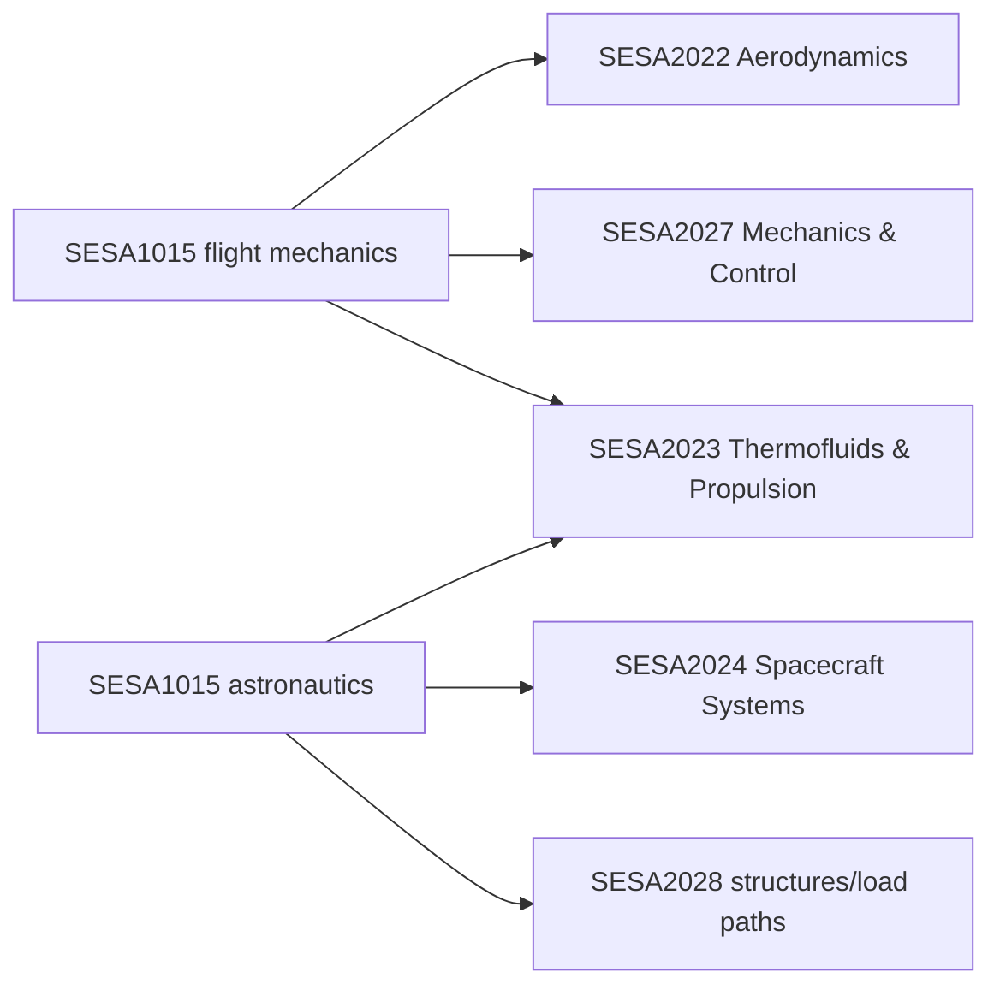

# SESA1015 Intro to Aero & Astro

> [!abstract] Module map
> This build covers the two technical strands used later in the degree: **Mechanics of Flight** and **Astronautics**. The aircraft strand starts with atmosphere, airspeed and aerodynamic coefficients, then develops performance, manoeuvres, trim, stability and preliminary sizing. The space strand connects mission purpose and environmental hazards to launch performance, staging and launch-system architecture. Each topic contains the physical picture, derivations, assumptions, worked checks and explicit links to the second-year modules that deepen it.

## How to use this build

1. Read the topic notes in order to build the physical model.
2. Keep [[SESA1015 Formula Sheet]] open while solving problems.
3. Attempt the relevant questions from the revision workbook before opening the worked solution.
4. Use the **Year 2 bridge** at the end of each topic to see which assumptions will be relaxed next year.

> [!important] Revision-workbook convention
> The visible wording of each question is treated as authoritative. Some calculator input cells contain old or randomised values that do not match the written prompt. Questions 32–34 are blank in every available copy; all other recoverable questions are solved below.

## Mechanics of Flight

| Order | Topic | What you should be able to do |
|---:|---|---|
| M01 | [[SESA1015 M01 - Atmosphere, Airspeed and Mach Number]] | Convert between IAS/EAS/TAS, density and Mach; use the ISA consistently |
| M02 | [[SESA1015 M02 - Aircraft Geometry, Forces and Coefficients]] | Draw force diagrams and non-dimensionalise forces and moments |
| M03 | [[SESA1015 M03 - Aerodynamic Characteristics and the Drag Polar]] | Interpret $C_L(\alpha)$, $C_D(C_L)$, $C_m(\alpha)$ and wind-tunnel data |
| M04 | [[SESA1015 M04 - Steady Level Flight and Stall]] | Find stall speed, level-flight speeds and maximum level speed |
| M05 | [[SESA1015 M05 - Minimum Drag, Power and Performance Curves]] | Locate minimum drag, minimum power and maximum $L/D$ |
| M06 | [[SESA1015 M06 - Jet Aircraft Range and Endurance]] | Derive and apply jet Breguet relations and optimum conditions |
| M07 | [[SESA1015 M07 - Propeller Aircraft Range and Endurance]] | Derive propeller range/endurance and distinguish the relevant optima |
| M08 | [[SESA1015 M08 - Glide and Climb Performance]] | Calculate glide angle/range and climb angle/rate |
| M09 | [[SESA1015 M09 - Take-off and Landing Performance]] | Build the ground-run equation and assess density, loading and thrust effects |
| M10 | [[SESA1015 M10 - Turning Flight and Manoeuvre Performance]] | Relate bank, load factor, radius, rate and stall boundary |
| M11 | [[SESA1015 M11 - Longitudinal Trim and Static Stability]] | Use moment balance, aerodynamic centre, neutral point and static margin |
| M12 | [[SESA1015 M12 - Aircraft Constraint Analysis]] | Construct and read a thrust-loading/wing-loading design map |

## Astronautics

| Order | Topic | What you should be able to do |
|---:|---|---|
| A01 | [[SESA1015 A01 - Astronautics Foundations, Missions and Applications]] | Relate mission objectives to payload, orbit and architecture |
| A02 | [[SESA1015 A02 - Space Environment]] | Identify dominant environmental hazards by altitude and mission |
| A03 | [[SESA1015 A03 - Launch Environment]] | Translate launch events into structural and subsystem loads |
| A04 | [[SESA1015 A04 - Rocket Equation and Launch Performance]] | Derive ideal rocket $\Delta v$, thrust, $I_{sp}$ and gravity/drag losses |
| A05 | [[SESA1015 A05 - Staging and Payload Fraction]] | Explain why staging works and evaluate mass-fraction trades |
| A06 | [[SESA1015 A06 - Launch Vehicles, Systems and Interfaces]] | Read a launch system as an integrated vehicle–payload–ground architecture |

## Revision workbook solutions

| Sheet | Questions | Main skills |
|---|---:|---|
| [[SESA1015 T01 - Stall and Level-Flight Solutions]] | 1, 2, 4, 14, 15, 30, 42 | Stall, drag, thrust and level-flight speed |
| [[SESA1015 T02 - Take-off and Landing Solutions]] | 3, 7, 19, 21–24, 28, 38–40 | Ground run, lift-off, landing and high-lift effects |
| [[SESA1015 T03 - Wind-Tunnel Data Reduction Solutions]] | 9–12, 41 | Lift curve, zero-lift angle, drag polar and coefficients |
| [[SESA1015 T04 - Range and Endurance Solutions]] | 5, 16, 20, 27, 29 | Fuel consumption, Breguet range and endurance |
| [[SESA1015 T05 - Climb and Glide Solutions]] | 17–18 | Excess thrust/power and flight-path angle |
| [[SESA1015 T06 - Turning Flight Solutions]] | 6, 25, 26, 31 | Bank, load factor, radius and rate |
| [[SESA1015 T07 - Trim and Static Stability Solutions]] | 8, 13 | Tail sizing, pitching moment and trim angle |
| [[SESA1015 T08 - Constraint Analysis Solutions]] | 35–37 | Design-point constraints |
| [[SESA1015 Revision Workbook Coverage]] | 1–42 audit | Complete coverage map; 32–34 blank |

## Concept index

- Flight variables: [[Dynamic Pressure and Aerodynamic Coefficients]] · [[Airspeed Measures]] · [[Wing Loading]]
- Performance: [[Parabolic Drag Polar]] · [[Minimum Drag and Minimum Power]] · [[Take-off Ground Run]] · [[Load Factor and Turn Performance]]
- Stability and design: [[Static Margin and Tail Volume]] · [[Aircraft Constraint Diagram]]
- Space systems: [[Space Environment Hazards]] · [[Launch Environment Loads]] · [[Rocket Mass Fractions]] · [[Multistage Rocket Performance]] · [[Launch Vehicle Interfaces]] · [[Space Mission Architecture]]

## The Year 2 bridge

- Aerodynamic coefficients and stability become [[SESA2022 T2 - Boundary Layers]], [[SESA2022 T4 - Thin Aerofoil Theory]], [[SESA2022 T5 - Finite Wing Theory]] and [[SESA2022 T6 - Aircraft Aerodynamics and Static Stability]].
- The static force balances become equations of motion, modes and control in [[SESA2027 A1 - Dynamic Systems and Aircraft Equations of Motion]], [[SESA2027 A2 - Longitudinal State-Space Model and Aerodynamic Derivatives]] and [[SESA2027 A3 - Longitudinal Dynamic Modes - SPO and Phugoid]].
- Atmosphere, Mach, engines and rockets continue through [[SESA2023 W01 - Thrust, Efficiency, Range and the ISA]], [[SESA2023 W03 - Compressible Flow, Normal Shocks and Nozzles]], [[SESA2023 W10 - Rocket Performance, Staging and Power Cycles]] and [[SESA2023 W11 - Solid Propellants and Rocket Nozzle Design]].
- Mission, orbit and subsystem consequences become the systems view of [[SESA2024 Astronautics Hub]].

## Source boundary

The technical content was built from the Mechanics of Flight course notes, the updated Mechanics of Flight lecture slides, the revision-question calculator, and Astronautics Parts 1–3. Duplicate older copies were used only as cross-checks.
