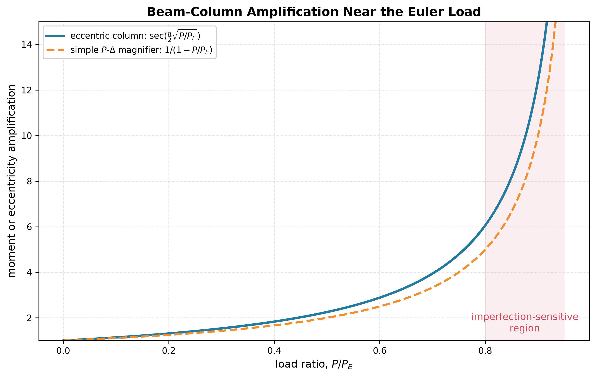

# Beam-Column Amplification

Compression amplifies bending caused by an initial crookedness or load eccentricity. For a pin-ended member with a sinusoidal initial shape of amplitude $a_0$,

$$
a=\frac{a_0}{1-P/P_E}.
$$

The maximum stress becomes

$$
\sigma_{max}=\frac PA+\frac{Pac}{I}.
$$

As $P\to P_E$, the ideal linear model predicts unbounded amplification. Real members fail earlier through yielding, nonlinear geometry, local buckling or material damage.

The design lesson is important: raising strength alone may do almost nothing if elastic stiffness controls $P_E$.

See [[SESA2028 S6 - Imperfect Columns, Beam-Columns and Plate Buckling]].

