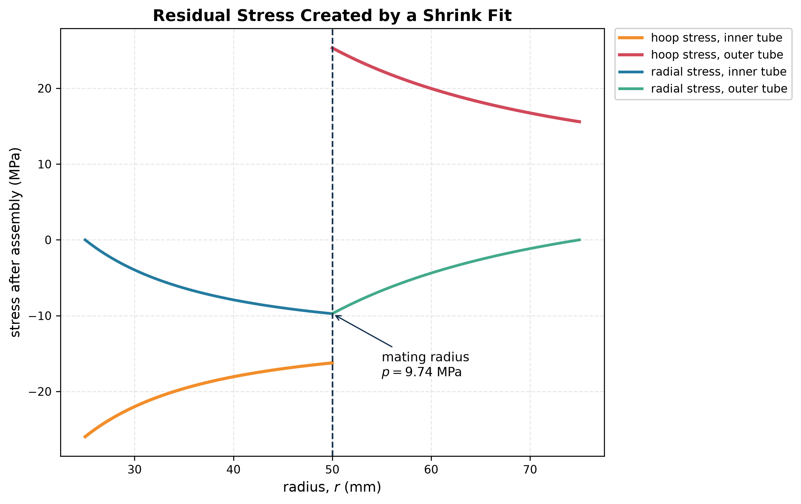

# Compound Cylinder

**What it is:** two (or more) concentric tubes assembled with an interference fit, so that residual stresses offset part of the service hoop stress at the bore.

## Why do it?

In a single thick cylinder under internal pressure the hoop stress is highest at the bore and falls steeply outward. The outer material is under-used, and simply adding thickness gives diminishing returns (as $b\to\infty$, $\sigma_\theta(a)\to p$ however thick the wall).

A shrink fit puts the **inner tube into hoop compression** and the **outer tube into hoop tension** *before* pressurisation. When service pressure is applied, the bore starts from a negative stress, so the **peak hoop stress is lower and the distribution is flatter**.

## Procedure

1. **Residual (shrink) field**: find the contact pressure $p_c$ from the interference ([[Shrink Fit]]). Then solve the inner tube under external $p_c$ and the outer tube under internal $p_c$ with [[Lame Equations]].
2. **Service field**: solve the *compound* cylinder as a single thick tube ($a$ to $b$) under the service pressure.
3. **Superpose** the two fields (valid while elastic and while the interface stays in contact).
4. Check the resultant hoop stress at the **inner bore** *and* at the **inner surface of the outer tube** (the jump at $r=c$). Either can govern.

## Key facts

- **Radial stress is continuous** at the interface ($=-p_c$ from the shrink fit); **hoop stress jumps**.
- The design aim is a more *uniform* use of material, not a lower stress everywhere.
- Autofrettage (deliberately yielding the bore) achieves the same idea in one piece.

Worked examples: [[FEEG2005 Exam 2015-16 Solutions]] A3, [[FEEG2005 Exam 2017-18 Solutions]] B2.
