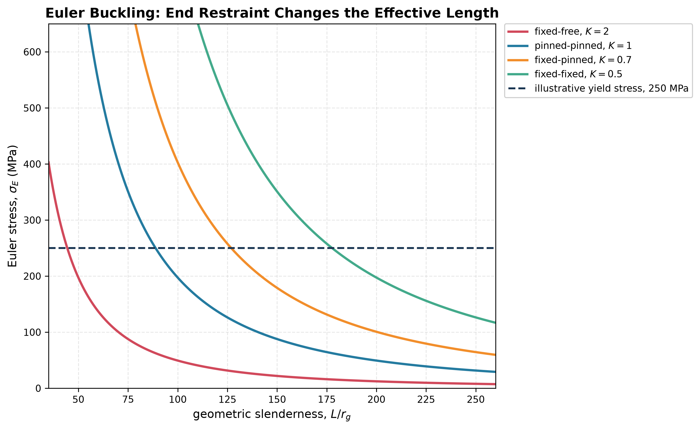

# Euler Buckling

Euler buckling is an elastic stability limit:

$$
P_E=\frac{\pi^2EI}{(KL)^2}.
$$

Use the least relevant second moment or solve about the principal axes for an unsymmetrical section. The effective-length factor $K$ represents end restraint, and because it is squared it is often more important than a small change in section area.

Euler theory assumes a straight, slender, elastic member; a centric load; ideal end conditions; and negligible shear deformation. Always compare $P_E$ with crushing/yielding and with any prescribed design factor.

See [[SESA2028 S5 - Euler Buckling and Effective Length]].

**Related (SESA2028 materials):** [[Specific Stiffness and Strength]] (the $E^{1/2}/\rho$ strut index) · [[SESA2028 Materials Tutorial MT3 - Lightweighting Solutions|MT3 Q5]]

## Year 1 foundation
- Pin-ended strut derivation and effective lengths: [[FEEG1002 A7 - Euler Buckling of Struts]].
