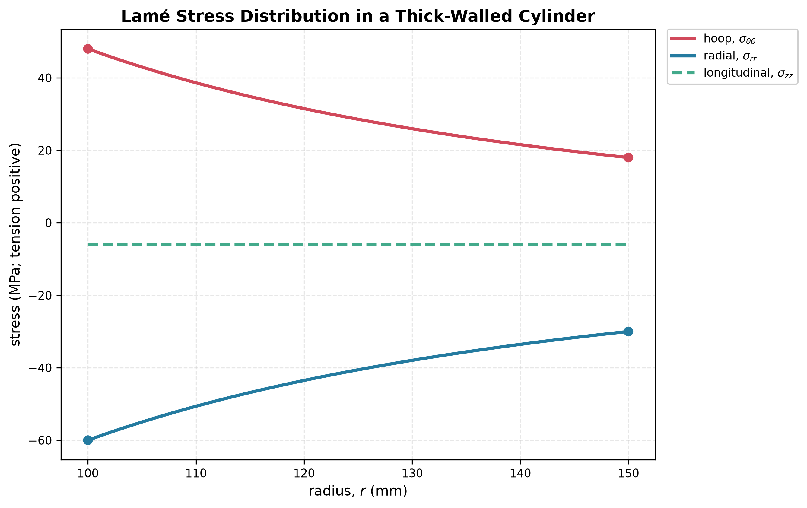

# Lame Thick-Cylinder Solution

Axisymmetric radial equilibrium is

$$
\frac{d\sigma_r}{dr}+\frac{\sigma_r-\sigma_\theta}{r}=0.
$$

Compatibility and linear elasticity lead to

$$
\sigma_r=A-\frac{B}{r^2},\qquad
\sigma_\theta=A+\frac{B}{r^2}.
$$

For inner and outer pressures $p_i,p_o$, impose

$$
\sigma_r(a)=-p_i,\qquad \sigma_r(b)=-p_o.
$$

The hoop stress is normally largest at the bore. Radial stress is not zero everywhere: it moves from $-p_i$ at the inner surface to $-p_o$ at the outer surface.

See [[SESA2028 S10 - Thick Cylinders and Shrink Fits]].

**Related (SESA2028 materials):** [[SESA2028 M2 - Fatigue - Fracture Surfaces, Mechanisms and Lifing|SESA2028 M2]] (lifing cracks in pressure vessels) · [[Shot Peening]]
