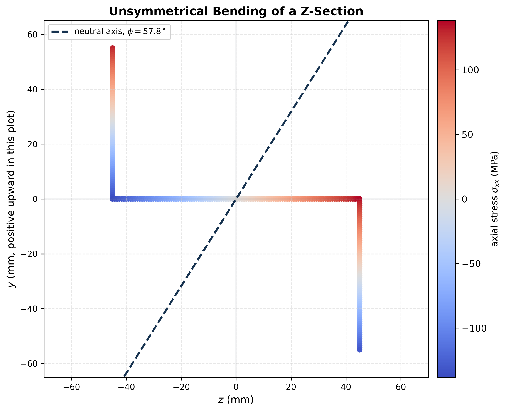

# Neutral Axis in Unsymmetrical Bending

For centroidal $y,z$ axes,

$$
\sigma_x=-\frac{M_zI_y+M_yI_{yz}}{\Delta}y
+\frac{M_yI_z+M_zI_{yz}}{\Delta}z,
\qquad \Delta=I_yI_z-I_{yz}^2.
$$

The neutral axis is the straight line obtained by setting $\sigma_x=0$. It always passes through the centroid for pure bending with no axial force, but it is generally not perpendicular to the applied moment vector.

If $M_y=0$,

$$
y=\frac{I_{yz}}{I_y}z.
$$

That simple result is a useful test of whether coupling has been retained. Maximum tensile or compressive stress occurs at a boundary vertex of a polygonal section because $\sigma_x$ is linear in $y,z$. Check every vertex rather than guessing the furthest point from a geometric axis.

See [[SESA2028 S1 - Section Properties and Unsymmetrical Bending]].

