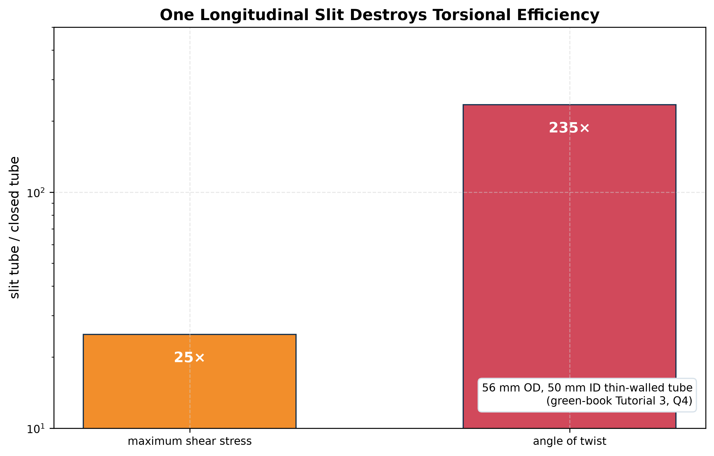

# Open-Section Torsion

**What it is:** St Venant torsion of thin **open** sections (channels, angles, I-sections, slit tubes). With no closed path for the shear flow to circulate, the shear stress circulates **within the thickness** of each wall, so the torsional stiffness is tiny.

$$
J\simeq\frac13\sum_i b_it_i^3,\qquad
\frac{d\phi}{dx}=\frac{T}{GJ},\qquad
\tau_{max,i}\simeq\frac{T\,t_i}{J}
$$

- $b_i$, $t_i$: length and thickness of wall segment $i$ (median-line lengths).
- The maximum shear occurs in the **thickest** wall, at its surface, and varies linearly through the thickness (zero at the mid-plane).
- For a curved wall (slit tube) use its arc length: $J\approx\tfrac13(2\pi r)t^3$.

## Open vs closed: why the difference is huge

For a thin tube of radius $r$ and thickness $t$:

$$
\frac{J_{closed}}{J_{open}}\approx\frac{2\pi r^3t}{\tfrac23\pi rt^3}=3\left(\frac rt\right)^2.
$$

With $r/t=20$ that ratio is about **1200**. Slitting a tube destroys its torsional stiffness (Tutorial 3).

## Assumptions and limits

- Free warping (St Venant). Near a built-in end, warping restraint adds axial stresses and stiffness (not covered by this formula).
- Thin walls ($t\ll b$); the $\tfrac13$ factor ignores end effects of each rectangle.

## Design priorities for a member that twists

1. Apply the load **through the shear centre** so no torque arises ([[Shear Centre]]).
2. **Close** the section (a torsion box).
3. Increase the enclosed area.
4. Only then thicken the walls.

See [[SESA2028 S4 - Torsion of Thin-Walled Sections]].
