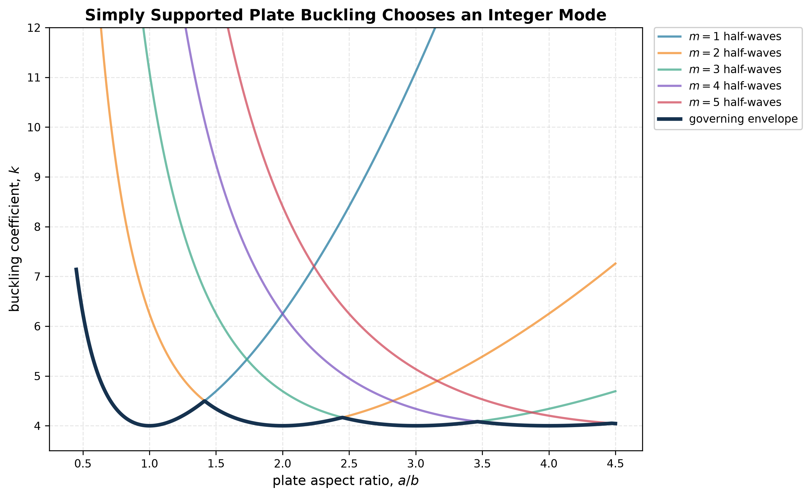

# Plate Buckling Coefficient

For a thin plate in uniform compression,

$$
\sigma_{cr}=k\frac{\pi^2E}{12(1-\nu^2)}\left(\frac tb\right)^2.
$$

The coefficient $k$ contains the boundary conditions, aspect ratio, loading pattern and admissible buckling mode. It is not a universal material constant.

For simply supported edges and a double-sine mode, trial integers $m,n$ represent half-waves. The physical critical stress is the minimum over admissible modes. As aspect ratio changes, the controlling integer can jump, producing a scalloped lower envelope.

The $t^2$ dependence explains why thin skins need closely spaced stiffeners: reducing the unsupported width can be more efficient than thickening the entire skin.

See [[SESA2028 S6 - Imperfect Columns, Beam-Columns and Plate Buckling]].

