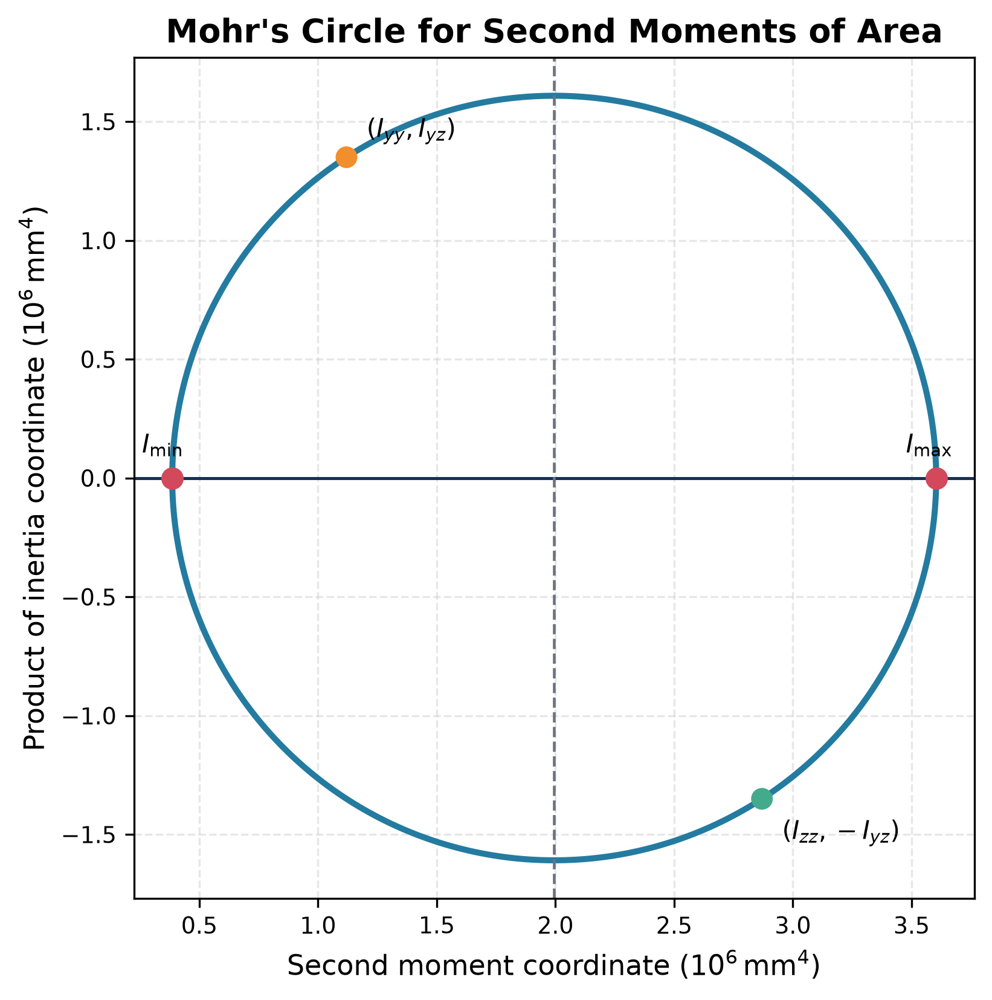

# Principal Second Moments of Area

The centroidal inertia matrix is

$$
\mathbf I=\begin{bmatrix}I_y&-I_{yz}\\-I_{yz}&I_z\end{bmatrix}.
$$

Its eigenvectors are the principal axes and its eigenvalues are the principal second moments:

$$
I_{1,2}=\frac{I_y+I_z}{2}
\pm\sqrt{\left(\frac{I_y-I_z}{2}\right)^2+I_{yz}^2}.
$$

On principal axes, $I_{12}=0$, so bending uncouples. The angle obeys

$$
\tan2\theta_p=\frac{2I_{yz}}{I_y-I_z}.
$$

The factor of two means two perpendicular physical axes correspond to one point on Mohr's circle. Use `atan2` or inspect the transformed product of inertia; a plain arctangent can put the axis in the wrong quadrant.

**Exam check:** $I_1+I_2=I_y+I_z$ and $I_1I_2=I_yI_z-I_{yz}^2$.

See [[SESA2028 S1 - Section Properties and Unsymmetrical Bending]].

