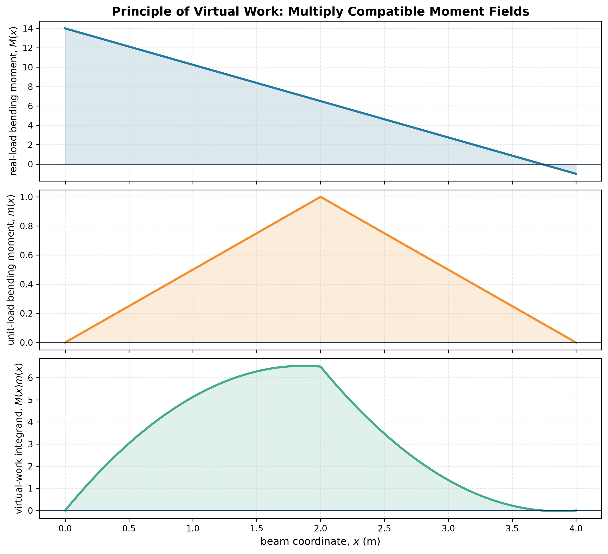

# Principle of Virtual Work

To find one displacement, keep the real structure and apply a unit virtual load at the required point in the required direction. Then

$$
\delta=\int\left(
\frac{Nn}{EA}+\frac{Mm}{EI}+\frac{Tt}{GJ}
\right)dx.
$$

Uppercase quantities belong to the real system; lowercase quantities belong to the unit-load system. For a rotation, apply a unit moment.

The most common failure is not calculus but bookkeeping. Split the integral at every discontinuity in load, internal force, stiffness, member direction or support condition.

See [[SESA2028 S8 - Virtual Work and Castigliano Theorems]].

