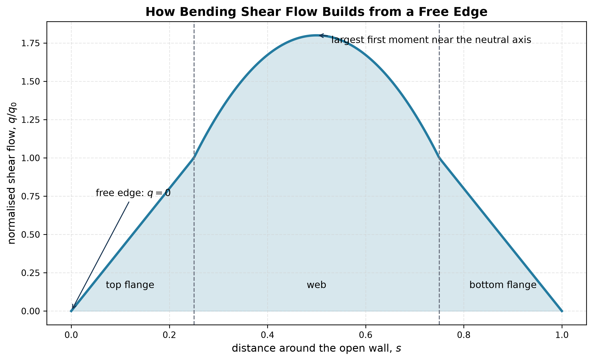

# Shear Flow

Shear flow $q$ is force per unit length along a thin wall:

$$
q=\tau t.
$$

In the uncoupled case,

$$
q(s)=\frac{VQ(s)}I,
$$

where $Q(s)$ is the first moment of the wall area accumulated from a free edge. This makes the boundary condition immediate:

$$
\boxed{q=0\text{ at an open free edge}.}
$$

For unsymmetrical sections use both running first moments and $\Delta=I_yI_z-I_{yz}^2$. At a branched junction, write algebraic flow equilibrium: the flows entering the node must equal those leaving it.

The flow can be continuous across a corner while stress jumps because $\tau=q/t$ and thickness may change.

See [[SESA2028 S3 - Shear Flow and Shear Centre]].

