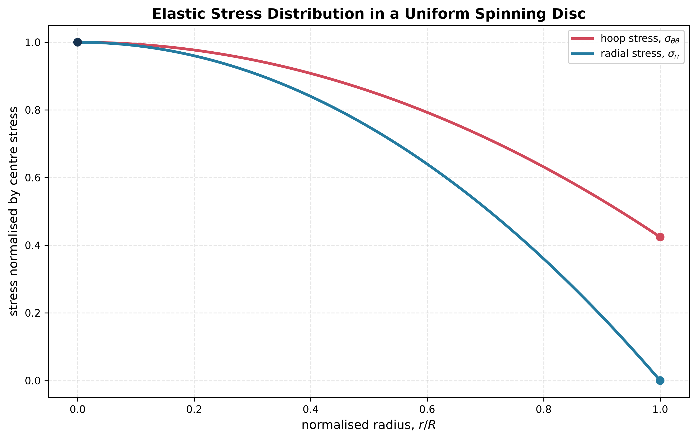

# Spinning Disc Stress

Rotation creates the radial body force $\rho\omega^2r$. Equilibrium is

$$
\frac{d\sigma_r}{dr}+\frac{\sigma_r-\sigma_\theta}{r}
+\rho\omega^2r=0.
$$

Use an axisymmetric radial displacement $u(r)$, express strains as

$$
\varepsilon_r=\frac{du}{dr},\qquad
\varepsilon_\theta=\frac ur,
$$

and combine them with the appropriate plane-stress constitutive law. For a solid disc, reject any (1/r) displacement term because the centre must remain finite. At a free outer radius, impose $\sigma_r=0$.

The hoop stress is tensile throughout a uniform solid disc and is commonly largest near the centre.

See [[SESA2028 S11 - Spinning Discs]].

**Related (SESA2028 materials):** [[FEEG2005 Exam 2022-23 Solutions|2022-23 MQ1]] (disc bore vs rim crack sites) · [[Paris Law]]
