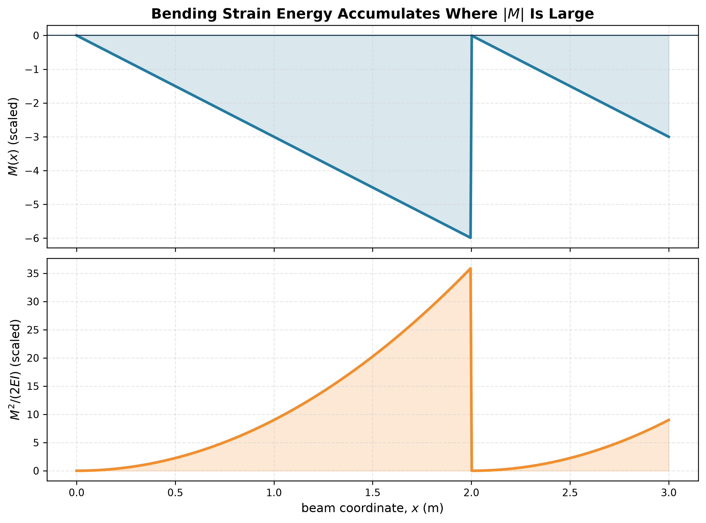

# Strain Energy

For a linearly elastic member,

$$
U=\int\left(
\frac{N^2}{2EA}+\frac{M^2}{2EI}
+\frac{T^2}{2GJ}+\frac{\kappa V^2}{2GA}
\right)dx.
$$

In slender beams, bending energy usually dominates, but axial energy can matter in frames and curved members; torsional energy matters in spatial or eccentric-load problems.

Energy is scalar and positive. That makes it excellent for displacement magnitude, but the sign of a displacement still comes from the direction of the dummy load or generalised force.

See [[SESA2028 S7 - Strain Energy and Conservation of Energy]].

**Related (SESA2028 materials):** [[Griffith Energy Balance]] (strain energy released by crack growth)

## Year 1 foundation
- Spring energy and the work–energy principle: [[FEEG1002 D3 - Work, Energy and Power]].
