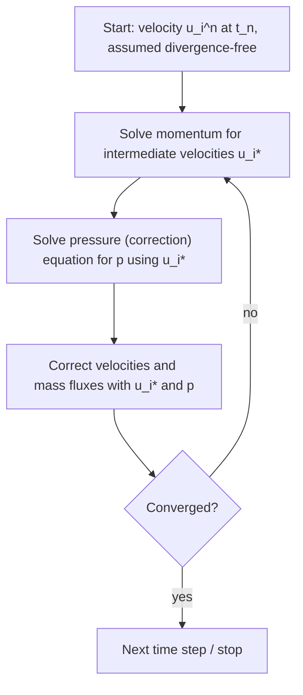

# SESA2029 A10 - Grids and Pressure-Based Solution Algorithms

> [!abstract] Summary
> **A. Grids.**
> - **Structured** grids ($i,j,k$-indexed; H, O, C topologies; multi-block) are efficient and accurate but hard to build around complex shapes, and they waste points in the far field.
> - **Unstructured** grids (any cell shape, no ordering) mesh anything at the press of a button and allow local refinement, but they are less accurate and less efficient.
> - **Hybrid** grids put an inflation (prism) layer on the walls and fill the rest with tets. This is the modern default for viscous flow.
> - **Inviscid** (Euler) grids need no boundary-layer resolution; **viscous** (RANS) grids need very fine, high-aspect-ratio wall cells.
>
> **B. Algorithms.** In incompressible flow, continuity is a **constraint**, not an evolution equation. Taking the divergence of momentum gives a **pressure Poisson equation**, which must be solved together with momentum.
> - **SIMPLE**-family methods (SIMPLE, SIMPLEC, PISO) do this in a **segregated** loop (memory-light, slower convergence), using **under-relaxation** to stay stable.
> - **Coupled** solvers solve momentum and pressure together (faster convergence, more memory).
> - Pressure-based solvers are the default for low-speed flow; density-based solvers remain best for hypersonic flow.

## Key Concepts
- [[Structured, Unstructured and Hybrid Grids]] · [[Pressure-Velocity Coupling and SIMPLE]] · [[Jacobi, Gauss-Seidel and SOR Iteration]]

---

## A. Grids (L11)

### Cell types
- **2D**: triangles and quadrilaterals.
- **3D**: tetrahedra, hexahedra, prisms/wedges, pyramids (to transition between hex and tet), and general polyhedra.

### Structured grids
Families of grid lines never cross within a family and cross each member of the other family once. So every node has a unique index $(i,j)$ or $(i,j,k)$ and a fixed set of neighbours: 4 in 2D, 6 in 3D.

- **Pros**:
  - neighbour connectivity is implicit, so programming is easy;
  - the matrix has a regular banded structure, which fast solvers exploit;
  - consecutive memory access vectorises well;
  - usually **more accurate**.
- **Cons**:
  - hard or impossible for complex geometries; building one can be a full-time job;
  - poor control of point distribution: clustering near the body forces tiny cells in regions that don't need them, wasting resources.

**Topologies around an aerofoil**:
| Topology | Description | Good for |
|---|---|---|
| **H-grid** | one family of lines follows the streamlines; rectangular computational block | turbomachinery cascades (lines pass between blades) |
| **O-grid** | one family forms closed loops around the body; the other runs radially to the outer boundary | inviscid aerofoils; poor wake resolution |
| **C-grid** | lines wrap the body and continue downstream as a wake cut | viscous aerofoils with a wake |

**Block-structured grids** divide the domain into blocks that are each structured (up to ~100 blocks for a whole aircraft). Block interfaces can be point-matched or need **interpolation**. Put interfaces where little is happening, because interpolation errors in important regions are bad news.

**Overset (chimera)** meshes overlap and interpolate between each other. They are useful for moving bodies, e.g. a rotor blade mesh rotating inside a fuselage mesh.

### Unstructured grids
- no $(i,j,k)$ ordering; cells of any shape;
- any number of neighbours;
- fit arbitrary boundaries;
- easy local refinement and **automatic adaptation**.

The price:
- connectivity must be stored explicitly;
- memory access is scattered, so the code is slower and harder to vectorise;
- higher truncation error than a good structured grid, especially triangles in boundary layers.

### Viscous vs inviscid meshes
- **Euler** solutions need no boundary-layer cells.
- **RANS** needs wall-normal clustering to the required $y_1^+$ ([[First-Cell Height and y-plus]]), with 10–20+ cells across the layer.
- The usual answer is a **hybrid** grid: **inflation layers** (stretched prisms or hexes) on the walls, surrounded by unstructured tets. You control the first-layer height, growth rate and number of layers.

### Grid adaptation
Solution-based adaptation adds cells where gradients are strong. On a wing, adaptation typically refines near the surface **and in the trailing-vortex wake**. That shows the original automatic grid under-resolved the wake, which controls downwash and therefore **induced drag**. Adaptation is a diagnostic as well as a fix: it shows where the flow is hard to resolve.

## B. Pressure-based algorithms (L11)

### Why pressure is awkward in incompressible flow
In compressible flow, $\partial\rho/\partial t$ evolves density and pressure follows from the equation of state (a **density-based** solver). With constant density, continuity only says the velocity field must be **divergence-free**. Pressure has no equation of its own; it is whatever field makes $\nabla\cdot\mathbf u = 0$.

**Derivation**. Write momentum in conservation form and apply implicit (backward) Euler:

$$
(\rho u_i)^{n+1}-(\rho u_i)^n = \Delta t\left(-\frac{\delta(\rho u_iu_j)}{\delta x_j}-\frac{\delta p}{\delta x_i}+\frac{\delta\tau_{ij}}{\delta x_j}\right)^{n+1}
$$

Take the divergence $\delta/\delta x_i$ and demand $\delta(\rho u_i)^{n+1}/\delta x_i = 0$ (and at $n$):

$$
\frac{\delta}{\delta x_i}\left(\frac{\delta p}{\delta x_i}\right)^{n+1} = \frac{\delta}{\delta x_i}\left(\frac{\delta\tau_{ij}}{\delta x_j}-\frac{\delta(\rho u_iu_j)}{\delta x_j}\right)^{n+1}
$$

This is a **Poisson equation** for pressure: **elliptic**, like Laplace's equation or the steady heat equation, so the iterative solvers of A3 apply. But it needs $\mathbf u^{n+1}$, and $\mathbf u^{n+1}$ needs $p^{n+1}$. **Momentum and pressure must be solved simultaneously.**

### SIMPLE (Semi-Implicit Method for Pressure-Linked Equations)
The equations are coupled and nonlinear, so the solution splits into **outer** and **inner** iterations.

Family members:
- **SIMPLE** needs under-relaxation;
- **SIMPLEC** is a consistent variant that allows larger relaxation factors;
- **PISO** uses extra corrector steps, suits transients and needs **no** under-relaxation.

### Segregated vs coupled
| | Segregated (SIMPLE-like) | Coupled |
|---|---|---|
| Sequence | solve $u$, then $v$, then $w$ one after another, then the pressure (correction), then update the fluxes, then energy/turbulence | solve momentum + pressure-continuity **together**, then energy/turbulence separately |
| Memory | low: one equation's matrix at a time | high: about 4× larger system |
| Convergence | relatively slow | faster (fewer iterations) |
| Choice | problem-dependent: switch if convergence stalls | |

### Under-relaxation
$$
\phi_{new} = \phi_{old}+\alpha\,\Delta\phi,\qquad \alpha<1
$$

This is the reverse of SOR's over-relaxation ([[Jacobi, Gauss-Seidel and SOR Iteration]]). Each iteration accepts only part of the computed change, which damps oscillation. Solvers expose separate factors for pressure (typically 0.3), momentum (0.7), turbulence quantities (0.8), density, body forces, etc. Lower them if residuals oscillate or diverge.

### Pressure-based vs density-based
- Historically: pressure-based for low-speed incompressible flow, density-based for high-speed compressible flow.
- Today both are extended across regimes. Pressure-based handles transonic flow; density-based reaches lower Mach numbers.
- **Default**: pressure-based for incompressible and low-Mach flow. Use density-based for hypersonic flow (Mach ≳ 4, re-entry).

## Links
- Parent: [[SESA2029 Digital Aerospace Methods Hub]] · Previous: [[SESA2029 A9 - Finite Volume Method]] · Next: [[SESA2029 A11 - CFD Errors, Verification, Validation and Mesh Quality]]
- FEA meshing counterpart: [[SESA2029 B7 - Meshing, Convergence and Mesh Checks]]

## Sources
- CFD Lecture 11, `02 - Sources/CFD/All_lectures_as_delivered.pdf` pp. 143–164 (grid figures after Blazek, *Computational Fluid Dynamics: Principles and Applications*); transcript `CFD.txt`
