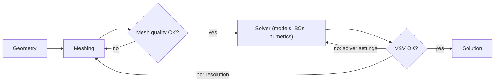

# SESA2029 A11 - CFD Errors, Verification, Validation and Mesh Quality

> [!abstract] Summary
> **Three kinds of CFD error**:
> - **modelling** (the equations are not reality: Euler instead of RANS, the turbulence model, transition);
> - **discretisation** (the grid and time step);
> - **iteration** (unconverged residuals).
>
> Round-off and truncation are their sources.
> - **Verification** asks "are we solving the equations right?": code checks and discretisation and iteration error.
> - **Validation** asks "are we solving the right equations?": comparison with experiment for modelling error.
>
> **Mesh quality** is measured by skewness, aspect ratio and (non-)orthogonality. Aim for skewness < 0.9, orthogonal quality > 0.2, and aspect ratio averaging < 5 away from walls. A result is only credible when it is **mesh-independent**.
>
> **Beyond RANS**: DNS resolves every scale, but costs about $Re^3$. LES resolves the big eddies and models the small ones. DES blends RANS near the walls with LES in separated regions.

## Key Concepts
- [[Verification and Validation]] · [[CFD Mesh Quality Metrics]] · [[Mesh Convergence and Grid Independence]] · [[DNS, LES and Scale-Resolving Simulation]]

---

## 1. Sources of error (L12)
| Error | Definition | Controlled by |
|---|---|---|
| **Modelling** | actual flow − exact solution of the mathematical model | better physics (NS vs Euler, turbulence/transition model), validation |
| **Discretisation** | exact PDE solution − exact solution of the discrete equations | grid and time-step refinement ([[Mesh Convergence and Grid Independence]]) |
| **Iteration (convergence)** | exact discrete solution − current iterate | driving residuals and monitored outputs flat ([[Residual vs Solution Error]]) |

- **Round-off**: finite precision. Double precision (≈$10^{-16}$) is standard; single precision (≈$10^{-8}$) can matter; quad is almost never needed.
- **Truncation**: the Taylor-series terms a scheme drops, i.e. its order of accuracy (A2).

**Typical example.** An Euler solution of the RAE 2822 aerofoil at $M = 0.729$ puts the shock in the wrong place compared with experiment. That is a **modelling** error: at this Reynolds number you must solve RANS with a turbulence model.

## 2. Verification and validation (L12)
- **Verification** ("solving the equations right"):
  - check the discretisation and iteration errors;
  - check the code against exact NS solutions or the **method of manufactured solutions** (invent a solution, compute the source term it needs, check the code reproduces it).

  Commercial codes are closed, so you trust the vendor's verification. Open-source codes can be inspected.
- **Validation** ("solving the right equations"): compare with experiments to measure the **modelling** error. A verified solution only gives you the answer of the *mathematical model*.

Experiments are not the absolute truth either. They carry errors and unknown boundary conditions. Validation is often a comparison of two imperfect approaches, e.g. lifting-line theory vs an inviscid CFD wing, each with known limitations.

**Life-cycle of a simulation**:

## 3. Mesh quality metrics (L12)
| Metric | Definition | Guidance |
|---|---|---|
| **Skewness** | departure of a cell from the equilateral cell of equal volume (0 = ideal) | max < 0.9; quad/hex angles ≈ 90°, tri angles ≈ 60°; included angles < 40° or > 140° destabilise |
| **Aspect ratio** | longest/shortest cell dimension (stretching) | < 5:1 in the bulk flow; up to ~10:1 in BL quads/prisms; ≤ 20–100 in important regions; near walls ≤ 20 (unsteady) or ≤ 200 (steady); average < 5, max ≈ 300 |
| **Non-orthogonality** | angle between the line joining two cell centres and the normal of their shared face (0° ideal) | keep < 70°; > 85° usually diverges. The software's **orthogonal quality** (0–1, 1 ideal) should be > 0.2 |

High aspect ratio is **beneficial** in boundary layers, where gradients are strongly one-directional, but harmful in the bulk flow. Solver meshing tools report min/max/average and a histogram per metric. Extreme minimum or maximum values often sit at sharp leading or trailing edges, so read the **average** for an overall picture and locate the outliers. Details in [[CFD Mesh Quality Metrics]].

## 4. Mesh independence (L12)
- A result that changes when you refine the mesh is not a result.
- Run at least **3 grids with big increments**, e.g. 80k → 300k → 1M cells. Small increments (300k, 400k, 500k) cannot reveal the trend.
- Plot each output ($C_L$, $C_D$, $C_M$, $x_{ac}$) against the number of cells, $N^{1/3}$ (cells per direction) or $h$, on log axes if needed. Look for the curve flattening.
- **Different outputs converge at different rates.** Lift and pitching moment converge early. **Drag**, especially induced drag, which depends on the wake, converges slowly.
- A published transonic-wing study needed ~10 million cells to settle the third decimal of $C_D$.

See [[Mesh Convergence and Grid Independence]].

## 5. Beyond RANS (L12)
In order of **increasing cost** and **decreasing reliance on turbulence models**, from cheapest to most expensive:
1. boundary-element (potential flow: XFOIL, panel codes);
2. Euler;
3. steady RANS;
4. **URANS** (captures large-scale shedding);
5. **hybrid RANS–LES**, e.g. **DES**;
6. **LES** (resolve the large eddies, model the small scales with a subgrid model);
7. **DNS** (resolve everything; no turbulence model).

### Why DNS is so expensive
- Large scales: length $\Lambda$, velocity $U$. Kolmogorov scale: $\eta = (\nu^3/\varepsilon)^{1/4}$.
- In equilibrium, production balances dissipation, with $P\sim U^3/\Lambda$. So $\eta\sim(\nu^3\Lambda/U^3)^{1/4}$ and $\Lambda/\eta\propto Re^{3/4}$.
- Points per direction $\propto Re^{3/4}$, so points in 3D $\propto Re^{9/4}$.
- Adding the time steps gives a cost of roughly $Re^3$.

Going from a resolvable $Re\approx10^6$ to a wind-tunnel $3\times10^6$ and then to flight $3\times10^7$ multiplies the cost by about $10^3$ for each factor of 10. Moore's law (via parallel CPUs and now GPUs) closes the gap slowly, and the power and CO₂ cost of supercomputers is now a constraint in itself.

![[dam_dns_cost_scaling.png|560]]

### LES and DES
- **LES** simulates the large, energy-carrying eddies down to a cut-off wavenumber $k_c$ in the $-5/3$ inertial range, and models the rest.
- **DES** runs RANS in attached boundary layers and switches to LES in separated regions.

Around a circular cylinder, steady RANS gives a steady wake, while URANS gives laminar-looking Kármán shedding. DES (especially on a fine grid) resolves multi-scale turbulent wake structure. DES/LES is increasingly used in industry for **stalled** configurations and unsteady loads. See [[DNS, LES and Scale-Resolving Simulation]] and [[Flow Past a Cylinder]].

## 6. Need-to-know (L12)
- Sources of error: modelling, discretisation, iteration.
- V&V strategies, and mesh metrics as a verification check.
- Computers limit scale-resolving methods; know the $Re^{9/4}$ and $Re^3$ scalings.
- Further CFD modules: FEEG6005 (low speed), SESA6082 (high speed).

## Links
- Parent: [[SESA2029 Digital Aerospace Methods Hub]] · Previous: [[SESA2029 A10 - Grids and Pressure-Based Solution Algorithms]] · Next: [[SESA2029 B1 - Introduction to FEA and the Matrix Displacement Method]]
- FEA counterpart: [[SESA2029 B10 - FE Verification, Validation and Model Updating]]

## Sources
- CFD Lecture 12, `02 - Sources/CFD/All_lectures_as_delivered.pdf` pp. 165–183 (LES/DES images after the Strelets group); transcript `CFD.txt`
